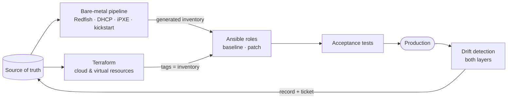

# Infrastructure Automation: Terraform · Ansible · Bare Metal

Working, tested examples of how a hybrid infrastructure platform is **built, configured, changed safely, and kept honest**: physical servers from a MAC address to production, cloud and virtual resources with Terraform, fleet configuration and patching with Ansible, and drift detection across both layers.

Prepared for the **canon** infrastructure automation engineering interview loop. Everything runs locally at **$0**.

```bash
make ci      # ~20s, no Docker: lint, validate, 12 terraform tests, 4 for_each demos, 20 unit tests
make all     # + Docker: converge 6 hosts, idempotence, input contract, drift, rolling patch, real parsers
```

---

## What is here

| Lab | The engineering problem it answers |
|---|---|
| [**Terraform**](labs/lab1-terraform/) | How do you structure modules and environments so a change to one thing can't destroy its neighbours, and how do you recover when an apply fails halfway? |
| [**Ansible**](labs/lab2-ansible/) | How do you write a role that is reused unchanged across a fleet, prove it is idempotent, and roll a risky change across hundreds of servers without an outage? |
| [**Bare metal**](labs/lab3-baremetal/) | How does a server get from a rack to production with no decision made by a human at a console? |
| [**Drift**](docs/drift-detection.md) | How do you know, every day, that what's running is still what the code says, and keep the evidence after you fix it? |

## Highlights

**Terraform — `for_each` done properly** ([lab 1](labs/lab1-terraform/))

- A module that walks through `for_each` over a map of objects, a **flattened nested map** with composite keys (`api-443`), a **filtered map** (zero instances when nothing matches), and **another resource's instances**.
- Four runnable demos with measured results. Removing one list item with `count` replaces 2 resources and destroys 1; with `for_each` it destroys exactly 1. Positional keys inside `for_each` replaced 4 firewall rules just to *add* one CIDR. A `count` → `for_each` migration with **`moved` blocks: 3 moves, 0 changes, identical object ids**.
- **12 native `terraform test` runs**, including guard-rail tests that were **mutation-checked** (remove the guard and the test fails).
- A real bug caught and fixed: one shared `random_id` silently re-coupled every service, so removing one replaced all of them. There's a regression test for it now.

**Ansible — a reusable, provably idempotent role** ([lab 2](labs/lab2-ansible/))

- `roles/baseline`: an input contract enforced by `argument_specs` + cross-field validation, the `_extra` merge pattern for layering group vars without clobbering defaults, `validate:` on sshd and sudoers writes, handlers that skip cleanly without systemd.
- **Idempotence proven, not claimed**: converge 6 hosts, second run `changed=0`. Six anti-patterns side by side with their fixes: the broken playbook changes **6 of 6** tasks on every run; ansible-lint catches only 5, and misses the timestamp entirely.
- **Verifies effective config, not files**: AlmaLinux 9 ships an sshd drop-in that silently overrides a `99-`-named hardening file. Every task succeeds, but `sshd -T` still shows `permitrootlogin yes`, and the role fails the host.
- Found and handled: `argument_specs` lets a bare YAML `no` through a `"no"`/`"yes"` choice list.
- A rolling patch that **stops itself after 3 of 6 hosts**, quarantines with diagnostics, and re-runs only the failures, including the subtle fix for `rescue`d failures not counting toward `max_fail_percentage`.

**Bare metal — one source of truth, validated by the real parsers** ([lab 3](labs/lab3-baremetal/))

- `hosts.yml` → per-MAC kickstarts, DHCP reservations, and the **Ansible inventory that hands new servers to lab 2's role**.
- A validator that refuses duplicate MACs, gateways outside the subnet, one-member bonds, and more, reporting every error at once.
- `dhcpd -t` and `ksvalidator` in a container found **three real bugs** unit tests couldn't see: an undeclared DHCP option 93, a kickstart `network` line wrapped with `\` (kickstart has no line continuation, so the bond and VLAN would silently never be configured), and an invalid `%packages` flag.

**Drift at both layers, with evidence that outlives the fix**

- Terraform `plan -detailed-exitcode` and Ansible `--check --diff`, with one exit-code contract: **0 clean · 2 drift · 1 incomplete**. The Ansible wrapper exists because `--check` exits 0 when it finds drift.
- Each finding becomes an immutable, timestamped record (human diff + JSON) that survives remediation, with viewers that show `content.image: web:2.1.0 -> web:2.2.0` rather than raw JSON.

## Architecture



**Terraform stops when the machine boots. Ansible owns what's inside it. Tests decide when it's done. Drift detection proves it stays that way.** Details: [`docs/architecture.md`](docs/architecture.md).

## Repository map

```text
.
├── Makefile                      # every check and demo; `make help`
├── .github/workflows/ci.yml      # calls the same make targets
├── docs/                         # design notes: architecture, patterns, drift, platforms
├── labs/
│   ├── lab1-terraform/           # module + envs + tests + for_each examples + drift tooling
│   ├── lab2-ansible/             # baseline & patch roles, idempotence examples, tests, drift tooling
│   └── lab3-baremetal/           # source of truth, renderer, iPXE/DHCP/kickstart, acceptance
└── RESEARCH.md                   # sources, verification log, and every bug found along the way
```

Every directory has a README explaining its part in detail.

## Documentation

| | |
|---|---|
| [Architecture](docs/architecture.md) | layer ownership, the Terraform/Ansible boundary, the handoffs |
| [Terraform patterns](docs/terraform-patterns.md) | modules, environments, `for_each` rules, state & locking, review pipeline, failed-apply recovery |
| [Ansible patterns](docs/ansible-patterns.md) | role design, idempotence, inventories, secrets, testing layers, patching at scale |
| [Bare-metal lifecycle](docs/bare-metal-lifecycle.md) | rack → production → decommission, latency-sensitive builds |
| [Drift detection](docs/drift-detection.md) | signals, exit codes, immutable records, remediation policy |
| [Platform translation](docs/platform-translation.md) | Spacelift, Alibaba Cloud, VMware vSphere, Windows |

## Verification

Every quoted result in the READMEs (command output, resource counts, exit codes, test totals) was produced by running the command next to it. `make all` re-runs the automated ones. [`RESEARCH.md`](RESEARCH.md) records the tool versions, the sources, and each bug found while building this, with how it was found and fixed.

The CI workflow calls the same `make` targets that were run locally. It has not yet run on GitHub, so treat its first run as the check on runner-specific details such as tool installation.

## License

[MIT](LICENSE)
