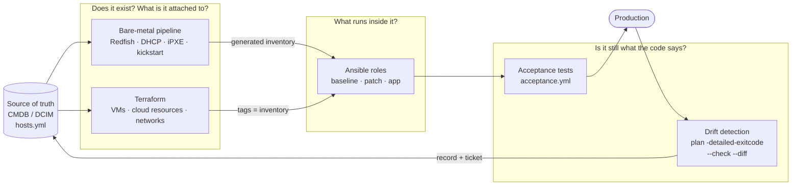

# Architecture: who owns which layer

An estate that mixes physical servers, virtual machines and cloud runs well only when every layer has exactly one owner, and the handoffs between owners are explicit, automated and re-runnable.

## Ownership

| Layer | Owner | Declares | Why this owner |
|---|---|---|---|
| Physical build | bare-metal pipeline | firmware, BIOS, disks, network identity, minimal OS | runs before any OS exists; driven by MAC and BMC |
| Resource lifecycle | **Terraform** | existence, size, attachment, networking, identity/IAM | state file = a real diff and a real drift signal |
| Inside the machine | **Ansible** | packages, config files, users, services, kernel parameters, patch level | ordered, batched, gated changes across a fleet |
| Proof | tests + drift jobs | "production-ready" and "still matches code" | a claim nobody measures is a claim nobody can rely on |

## The boundary between Terraform and Ansible

**Terraform stops when the machine boots.** Ansible *can* create VMs, and Terraform *can* run provisioners, but each is worse at the other's job:

- Terraform's state gives a real diff and a drift signal (`plan -detailed-exitcode`). Ansible has no equivalent state.
- Ansible gives ordered, batched, health-gated rollouts (`serial`, `max_fail_percentage`, handlers). Terraform applies a graph with no notion of "one canary, then 5, then 25%".

Anti-pattern: a `local-exec` provisioner that calls `ansible-playbook`. Configuration failures get hidden from state, one half can't be re-run without the other, and the apply's success no longer means what it says. The two are separate pipeline steps, each independently re-runnable.

## The handoffs

| From → to | Mechanism | Why it isn't a list someone maintains |
|---|---|---|
| source of truth → bare metal | `render.py` generates kickstarts + DHCP reservations | validated before rendering (lab 3) |
| bare metal → Ansible | generated `out/inventory.yml`, group `newly_built` | the build writes the inventory (lab 3) |
| Terraform → Ansible | instance **tags** read by a dynamic inventory plugin (`aws_ec2`, vCenter) | tags are set by the same code that creates the instance |
| first boot → Ansible | kickstart `%post` / cloud-init does only reachability + registration | anything more is configured once and never checked again |
| Ansible → production | acceptance play passes, *then* monitoring, backups, patch group, load balancer | "installer finished" isn't "ready" |
| production → code | drift record + ticket; deliberate drift becomes a module/role change | drift is a bug report against the automation |

## Same roles everywhere

Keeping the OS install thin means the layer above the hardware stops caring whether it *is* hardware. The `baseline` role in lab 2 runs unchanged on a container, a VM, or a server built by lab 3's pipeline. Only the connection settings differ. Divergence between physical and virtual estates shows up in configuration code first, so one role library for both is what keeps a hybrid estate manageable.

## The same model on AWS

Nothing in the layer ownership changes; the tools in each slot do, and one constraint is added. [`aws-platform.md`](aws-platform.md) is the detail. In summary:

| Layer | On-premises | On AWS |
|---|---|---|
| the machine exists | iPXE + kickstart from `hosts.yml` | the EC2 API, from `cloud-hosts.yml` via Terraform |
| identity at first boot | kickstart `%post` (minimal, by design) | cloud-init user data (minimal, for the same reason — both run once and are then invisible drift) |
| the handoff | a rendered inventory file | **tags.** Terraform stamps them, `aws_ec2` groups on them, and neither side keeps a list of the other's resources |
| access | SSH with a key from a vault | Session Manager: no inbound rule, no bastion, no key; IAM authorises and CloudTrail records |
| inside the machine | `baseline` + `kernel` + `patch` | the same roles, unchanged |
| **boot-time kernel settings** | Ansible, then a scheduled reboot | **the AMI**, because a change to a running Auto Scaling instance is discarded by the next instance refresh |

That last row is the only real asymmetry, and it is the same lesson as a kickstart `%post`: a one-time change to a machine that will be replaced is drift with a delay on it.
